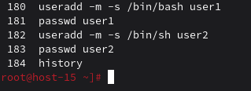
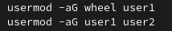
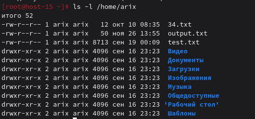
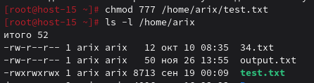
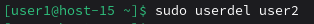
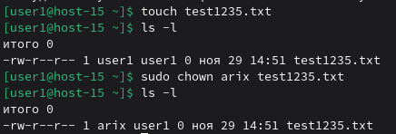

# Управление пользователями

1) Добавьте пользователей user1 и user2:
    1.1) user1 - оболочка bash
    1.2) user2 - оболочка sh
    1.3) установите им пароли



2) Назначьте пользователю 1 группу администраторов, польователя 2 добавте в группу пользователя 1



3) Что такое права доступа? Выведите права доступа на файлы в директории пользователя

Права доступа - это система разрешений, определяющая какие пользователи могут читать (r), записывать (w) или выполнять (x) файлы и директории.
Права доступа можно определить для владельца (u), группы (g) и всех остальных (o)



4) Как изменить права на файлы? Создайте файл который будет на который у всез пользователей будут все возможные права

Права на файлы можно изменить командой chmod либо тремя цифрами от 0 до 7 - первая для прав владельца, вторая для прав группы, третья для всех остальных. Цифры соответструют восьмеричному числу, у которого в двоичном представлении первая цифра отвечает за права на чтение, вторая - на запись, третья - на выполнение. 1 - есть право, 0 - нет. (то есть 517, например означает права на чтение и выполнение для владельца, только на выполнение для группы, все права для остальных, так как в двоичной системе это будет выглядеть как 101 001 111). Второй способ - <буква, кому изменяются права доступа u/g/o/a><+/- (+ добавить право, - удалить)><буква(ы) r, w, x соответствующие правам на чтение, запись и выполнение> (Например u-rw значит запретить владельцу читать и писать в файл)



5) Как называется учётная запись встренного администратора в linux?

root

6) Как выполнить команду от имени администратора?

При помощи команды 
```bash
sudo <команда>
```
или можно зайти под рута при помощи
```bash
su -
```

7) Есть ли ограничения у суперпользователя?

Нет

8) Удалите пользователя 2 с помощью пользователя 1.



9) Как можно изменить владельца папки? измените владельца папки из пункта 4

команда chmod

