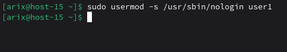

# Запрещаем

1. Запретите пользователю user1 из предыдщуего задания выполнять вход в систему
2. Как вы это сделали?

Заменив оболочку пользователя на nologin


3. Какие ещё способы это сделать вы знаете?

Заблокировать пароль
```bash
sudo passwd -l user1
```

Полностью заблокировать учётную запись
```bash
sudo passwd -L user1
```

Изменить срок действия пароля
```bash
sudo chage -E 0 user1
```

Временная блокировка
```bash
sudo usermod -e 1970-01-01 user1
```

4. Можно ли создать пользователей с одинаковыми username?

Нет