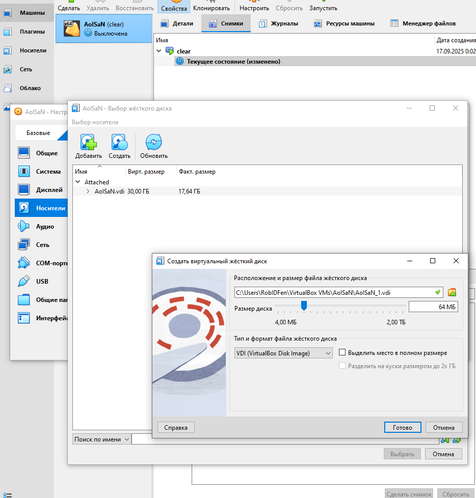
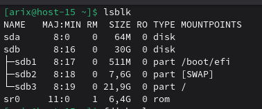
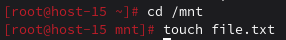
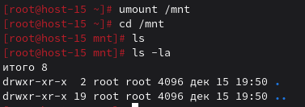
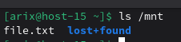

# Продолжаем

1. Выведите содержимое fstab. Что хранится в fstab?

```bash
proc		/proc			proc	nosuid,noexec,gid=proc				0 0
devpts		/dev/pts		devpts  nosuid,noexec,gid=tty,mode=620,ptmxmode=0666	0 0
tmpfs		/tmp			tmpfs	nosuid						0 0
UUID=50618cc0-1706-4f88-82fa-151b14781c0c	/	ext4	relatime	1	1
UUID=7A69-43CB	/boot/efi	vfat	umask=0,quiet,showexec,iocharset=utf8,codepage=866	1	2
UUID=e10d26e8-0d4f-4c45-9029-06389fc8f74e	swap	swap	defaults	0	0
/dev/sr0	/media/ALTLinux	udf,iso9660	ro,noauto,user,utf8,nofail,comment=x-gvfs-show	0 0
```
В fstab хранится таблица статического монтирования файловых систем. Содержит информацию о том, какие разделы/диски монтировать при загрузке системы, их точки монтирования, типы ФС и параметры.

2. Добавьте в виртуальную машину ещё один диск



3. Узнайте как ситема видит ваш диск - выведите информацию о блочных устройствах



4. С помощью полученной информации создайте на диске таблицу разделов и фаловую систему ext4

```bash
parted /dev/sda mklabel gpt
parted /dev/sda mkpart primary ext4 0% 100%
mkfs.ext4 /dev/sda1
```

5. Примонитруте диск в каталог /mnt

```bash
mkdir -p /mnt
mount /dev/sda1 /mnt
```

6. Зайдите в каталог и создайте там файлы



7. Отмонтируйте диск и проверье остались ли файлы


Нет, файла там больше нет

8. Сделайте так чтобы диск автоматически подключался при загрузке систем ( добавьте информацию о нём с fstab)

Добавил в /etc/fstab строку 
/dev/sda1 /mnt ext4 defaults 0 2

9. Проверьте корретность записанных в fstab данных перед перезагрузкой

```bash
mount -a
```
Ошибок нет

10. Перезагрущите систему и убедитесь что диск был подключён к системе


Файл на месте