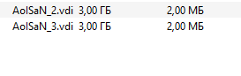
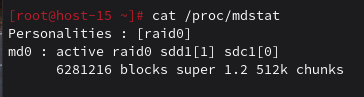

# Продолжаем

1. Raid массивы, что такое икакие бывают

RAID (Redundant Array of Independent Disks) - технология виртуализации данных, объединяющая несколько физических дисков в логический массив для повышения производительности и/или отказоустойчивости.

RAID 0 - чередование данных, повышает производительность, но без отказоустойчивости

RAID 1 - зеркалирование, полное дублирование данных на всех дисках

RAID 5 - чередование с распределенной четностью, требует минимум 3 диска

RAID 6 - как RAID 5, но с двойной четностью, устойчив к потере 2 дисков

RAID 10 (1+0) - комбинация зеркалирования и чередования

2. Добавьте в виртуальную машину 2 диска отформатируйте их в ext4

Добавил

```bash
parted /dev/sdc mklabel gpt
parted /dev/sdc mkpart primary 0% 100%
mkfs.ext4 /dev/sdc1

parted /dev/sdd mklabel gpt
parted /dev/sdd mkpart primary 0% 100%
mkfs.ext4 /dev/sdd1
```


3. Создайте из них raid 0 массив

```bash
mdadm --create /dev/md0 --level=0 --raid-devices=2 /dev/sdc1 /dev/sdd1
```

4. Проверье всё ли работает



5. Удалите raid0 и создайте raid1

```bash
mdadm --stop /dev/md0
mdadm --zero-superblock /dev/sdc1 /dev/sdd1

mdadm --create /dev/md1 --level=1 --raid-devices=2 /dev/sdc1 /dev/sdd1
```

6. В чём между ними разница?

У RAID 1, в отличие от RAID 0 высокая отказоустойчивость (выдерживает отказ одного диска), но ниже производительность и эффективность использования пространства (50% против 100% у RAID 0)

7. Есть ли файловые системы которые поддерживают raid массивы без стороненго ПО

Да, например ZFS и Btrfs

8. Можно ли создать raid массив во время установки системы?

Да
