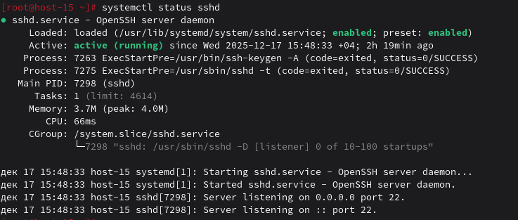

# Юниты

1. Что такое systemd юнит?

systemd юнит - это конфигурационный файл, который описывает, что и как нужно запустить. Управляет службами, устройствами, точками монтирования и т.д.

2. Проверье статус любого systemd юнита, какую информацию выводит эта кманда?


Выводит загрузку, путь к юниту, состояние (активен/неактивен), процесс, логи. 

3. ПОпробуйте оставновить сервис.

```bash
systemctl stop sshd
```

4. Перезапустите его.

```bash
sudo systemctl restart sshd
```

5. УДалите из автозагрузки

```bash
sudo systemctl disable sshd
```

6. Верните обратно

```bash
sudo systemctl enable sshd
```

7. Что такое таймеры?

timer — активация других единиц по таймеру, предоставляет функционал, похожий на сron (Запускатор чего-либо в определённый промежуток веремени т.е по таймеру).