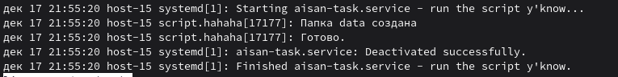
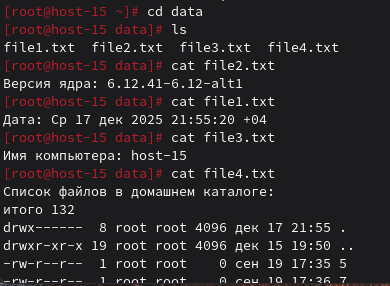

# Пишем юниты

1. Создайте скрипт который создаёт папку заполняет её файлами ( имена 1-4 ) и записывает в них информацию
о текущей дате, версии ядра, имени компьютера и списе всех файлов в домашнем каталоге пользователя от которого выполняется скрипт( не забудьте сдлеать проверку на существование файлов и папок)

```bash
#!/bin/bash
set -euo pipefail

folder="data"

if [ ! -d "$folder" ]; then
    mkdir -p "$folder"
    echo "Папка $folder создана"
else
    echo "Папка $folder уже существует"
fi

for i in 1 2 3 4; do
    file="$folder/file$i.txt"
    if [ -f "$file" ]; then
        echo "Файл уже существует. ПЕРЕЗАПИСЫВАЮ!!!"
    fi

    case $i in
        1) echo "Дата: $(date)" > "$file" ;;
        2) echo "Версия ядра: $(uname -r)" > "$file" ;;
        3) echo "Имя компьютера: $(hostname)" > "$file" ;;
        4) {
            echo "Список файлов в домашнем каталоге: "
            ls -la
           } > "$file" ;;
    esac
done

echo "Готово."
```

2. Создайте юнит который будет вызывать этот скрипт при запуске. Проверьте

```bash
touch /etc/systemd/system/aisan-task.service
ls /etc/systemd/system
vim /etc/systemd/system/aisan-task.service
```

```bash
[Unit]
Description=run the script y'know
After=network.target

[Service]
Type=oneshot
ExecStart=/usr/local/bin/script.hahaha
User=root

[Install]
WantedBy=multi-user.target
```

```bash
systemctl daemon-reload
systemctl start aisan-task
systemctl status aisan-task
```



3. Создайте таймер который будет вызывать выполнение одноимённого systemd юнита каждые 5 минут.


```bash
[Unit]
Description=8D

[Timer]
OnBootSec=5min
OnUnitActiveSec=5min

[Install]
WantedBy=timers.target
```

4. От какого пользователя вызыаются юниты поумолчанию?

root

5. Создайте пользователя от имени которого будет выполняться ваш скрипт.

```bash
useradd -m -s /bin/bash unit_executing_user
```

6. Дополните юнит информацией о пользователе от которого должен выплняться скрипт.

После [Service] надо прописать User=имя_пользователя

```bash
[Unit]
Description=run the script y'know
After=network.target

[Service]
Type=oneshot
ExecStart=/usr/local/bin/script.hahaha
User=unit_executing_user

[Install]
WantedBy=multi-user.target
```

7. Дополните ваш скрипт так, что бы он независимо от местоположения всега выполнялся в домашней папке того кто его вызывает.

В начало добавить
```bash
cd ~
```