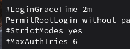
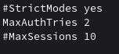
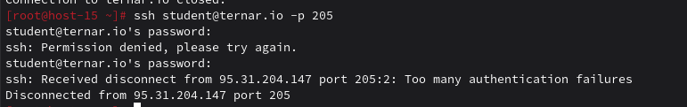
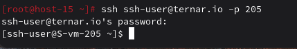
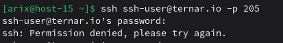

# Настриваем

1. Какой по умолчанию используется порт для поключения?

22

2. Можно ли его изменить? если да то как?

Да, можно изменить порт в /etc/openssh/sshd_config
Раскомментировать Port 22 и поставить туда другой порт 
```bash
Port какой-то_порт
```
после изменения нужно прописать
```bash
systemctl restart sshd
```

3. Какая служба отвечает за обработку запросов на подключения по ssh?

sshd

4. Какой файл конфигурации отвечает за его настройку?

/etc/openssh/sshd_config

5. Попробуйте подключиться по ssh к предоставленному вам серверу

```bash
ssh student@ternar.io -p 205
```
Подключился


6. Отредактируйте файл настроек на сервере так, чтобы была возможность подключиться к серверу используя пользователя root

Раскомментировал в /etc/openssh/sshd_config
```bash
PermitRootLogin without-password
```


7. Измените колличество ошибок ввода пароля перед сборосом соединения, покажите эти измененения

Там же раскомментировал и изменил 
```bash
MaxAuthTries 2
```


Получилось. После двух неудачных попыток отсоединило

8. Создайте пользователя ssh-user и попробуйте им подключиться к серверу

```bash
sudo useradd -m ssh-user
sudo passwd ssh-user

ssh ssh-user@ternar.io -p 205
```


9. Ограничте ему возможность подключения к серверу

Сделано.


10. Как вы это сделали?

Всё в тот же файл конфигурации добавил
```bash
DenyUsers ssh-user
```

11. Что хранится в файле known_hosts?

публичные ключи удалённых серверов, с которыми ранее устанавливалось соединение