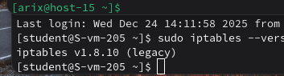
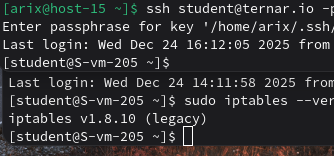
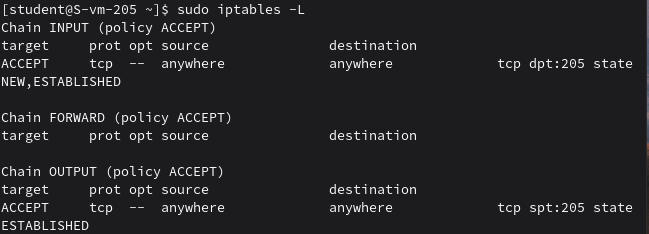
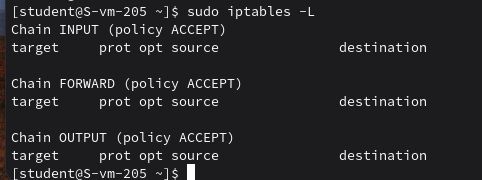

# Открываем iptables

1. Установите iptables

```bash
sudo apt-get update
sudo apt-get install iptables
```
Установил

2. Проверьте осталась ли возможность подключения по ssh к вашему серверу

Да, осталась



3. Почему может пропасть такая возможность?

Возможность подключения по SSH может пропасть после настройки iptables, так как firewall начинает фильтровать входящие соединения, и при отсутствии правила, разрешающего TCP-порт 205, новые SSH-подключения будут заблокированы.

4. Откройте нужный порт на сервере чтобы восстановить подключение

Чтобы это сделать, нужно написать
```bash
sudo iptables -A INPUT -p tcp --dport 205 -m state --state NEW,ESTABLISHED -j ACCEPT
sudo iptables -A OUTPUT -p tcp --sport 205 -m state --state ESTABLISHED -j ACCEPT
```

5. Это будет udp или tcp прот?

tcp, так как SSH использует TCP-соединение

# Сохраняем

6. Сохраняются ли записанные вами правила после перезагрузки?

нет
перед перезагрузкой:

после:


7. Как их сохранить?

можно сохранить текущие правила в файл
```bash
sudo iptables-save | sudo tee /etc/iptables.rules > /dev/null
```
для загрузки можно создать systemd-сервис:
```bash
[Unit]
Description=Restore iptables rules
Before=network.target

[Service]
Type=oneshot
ExecStart=/sbin/iptables-restore /etc/iptables.rules

[Install]
WantedBy=multi-user.target
```

При работе с firewall не рекомендую отключаться от текущей сессии ssh. Лучше подключаться из другой консольки.